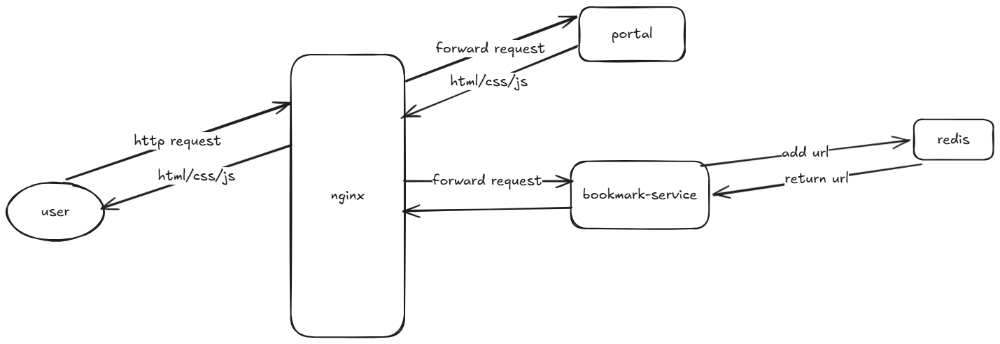

# Bookmark Service - Deployment

GitOps-ready deployment configuration for the Bookmark Service application stack.

## 📋 Table of Contents

- [Overview](#overview)
- [Architecture](#architecture)
- [Prerequisites](#prerequisites)
- [Quick Start](#quick-start)
- [Environment Configuration](#environment-configuration)
- [Project Structure](#project-structure)
- [Services](#services)
- [Deployment](#deployment)
- [Monitoring & Health Checks](#monitoring--health-checks)
- [Troubleshooting](#troubleshooting)

---

## 🎯 Overview

This directory contains the complete Docker Compose configuration for deploying the Bookmark Service stack, including:

- **Redis**: Cache & data storage backend
- **Bookmark Service**: Go application providing bookmark management APIs
- **Portal**: Frontend web application
- **Nginx**: Reverse proxy and API gateway

All services are containerized and managed through Docker Compose with health checks and automatic restart policies.

---

## 🏗️ Architecture



---

## 📦 Prerequisites

### System Requirements
- **Docker**: 20.10+
- **Docker Compose**: 2.0+
- **RAM**: 1GB minimum (2GB recommended)
- **Storage**: 500MB available space

### Check Installation
```bash
docker --version
docker-compose --version
```

### Ports Required
- **80** (HTTP) - Nginx reverse proxy
- **6379** (Redis internal) - Internal only, not exposed

---

## 🚀 Quick Start

### 1. Clone & Setup

```bash
cd deployment
```

### 2. Configure Environment

```bash
# Copy example configurations
cp redis/.env.example redis/.env
cp bookmark-service/.env.example bookmark-service/.env

# Edit if needed (optional - defaults work for local dev)
# vim redis/.env
# vim bookmark-service/.env
```

### 3. Start Services

```bash
# Build and run all services
docker-compose up -d

# View logs
docker-compose logs -f

# Check service status
docker-compose ps
```

### 4. Verify Deployment

```bash
# Health check endpoint
curl http://localhost/health

# Swagger API docs
curl http://localhost/swagger/

# Portal frontend
open http://localhost
```

### 5. Stop Services

```bash
# Stop all services
docker-compose down

# Stop and remove volumes (careful!)
docker-compose down -v
```

---

## 🔧 Environment Configuration

### Redis Configuration

**File**: `redis/.env`

```env
# Redis server address (for docker-compose: service_name:port)
REDIS_ADDR=redis:6379

# Authentication password (empty = no auth)
REDIS_PASSWORD=

# Database number (0-15)
REDIS_DATABASE=0
```

**For production**: Use strong password and database isolation.

### Bookmark Service Configuration

**File**: `bookmark-service/.env`

```env
# Application Configuration
APP_PORT=8080
SERVICE_NAME=bookmark-service
INSTANCE_ID=  # Auto-generated if empty

# Redis Configuration
REDIS_ADDR=redis:6379
REDIS_PASSWORD=
REDIS_DATABASE=0
```

**Notes**:
- `SERVICE_NAME` is required and used in health checks
- `INSTANCE_ID` is auto-generated if not provided (UUID v4)
- `APP_PORT` must match docker-compose service port mapping

---

## 📁 Project Structure

```
deployment/
├── README.md                           # This file
├── .gitignore                          # Git ignore rules
├── docker-compose.yaml                 # Main orchestration file
│
├── redis/
│   └── .env.example                    # Redis configuration template
│
├── bookmark-service/
│   └── .env.example                    # Service configuration template
│
├── nginx/
│   └── nginx.conf                      # Reverse proxy configuration
│
└── docs/
    └── [Additional documentation]

```

**Key Files**:
- `docker-compose.yaml` - Service definitions and dependencies
- `nginx/nginx.conf` - API routing and static file serving
- `.gitignore` - Prevents committing sensitive files (.env, secrets, etc.)

---

## 🔌 Services

### Redis
- **Container**: `bookmark-redis`
- **Image**: `redis:7-alpine`
- **Port**: `6379` (internal only)
- **Health Check**: Redis PING command every 10s
- **Volume**: `redis_data` (persistent storage)
- **Restart Policy**: `unless-stopped`

### Bookmark Service
- **Container**: `bookmark-service`
- **Build**: From `../bookmark-service/Dockerfile`
- **Port**: `8080` (internal)
- **Dependencies**: Requires Redis healthy
- **Config**: Via `.env` file
- **Restart Policy**: `unless-stopped`

### Portal
- **Container**: `bookmark-portal`
- **Image**: `ebvn/bookmark-app-portal:mono`
- **Port**: `3000` (internal)
- **Type**: Frontend web application

### Nginx
- **Container**: `bookmark-nginx`
- **Image**: `nginx:alpine`
- **Port**: `80` (public)
- **Role**: Reverse proxy, API gateway, static file server
- **Config**: Mounts `nginx/nginx.conf`
- **Restart Policy**: `unless-stopped`

---

## 🚢 Deployment

### Local Development

```bash
# Start with logs
docker-compose up

# Run in background
docker-compose up -d
```

### Production Deployment

#### Before Deployment
1. Review and test all `.env` files
2. Ensure sufficient resources allocated
3. Set up monitoring (logs, metrics)
4. Plan backup strategy for Redis volumes

#### Deploy

```bash
# Pull latest images
docker-compose pull

# Build service image
docker-compose build bookmark-service

# Start with healthchecks
docker-compose up -d

# Verify all services healthy
docker-compose ps
```

#### Verify Health

```bash
# Check service health
curl http://localhost/health

# Monitor logs
docker-compose logs --follow

# Check individual service logs
docker-compose logs bookmark-service
docker-compose logs redis
docker-compose logs nginx
```

### Update Services

```bash
# Update specific service
docker-compose up -d --no-deps --build bookmark-service

# Without downtime (for stateless services)
docker-compose up -d --no-deps --build --pull always
```

### Data Persistence

Redis data is stored in the named volume `redis_data`. To backup:

```bash
# Create backup
docker run --rm -v bookmark_redis_data:/data -v $(pwd):/backup \
  alpine tar czf /backup/redis_backup.tar.gz /data

# Restore from backup
docker run --rm -v bookmark_redis_data:/data -v $(pwd):/backup \
  alpine tar xzf /backup/redis_backup.tar.gz -C /
```

---

## 📊 Monitoring & Health Checks

### Built-in Health Checks

Each service has configured health checks:

```bash
# View health check status
docker-compose ps

# Health endpoint
curl http://localhost/health
```

### Service Status

```bash
# Full status
docker-compose ps

# Real-time logs
docker-compose logs -f

# Specific service
docker-compose logs -f bookmark-service
```

### Performance Monitoring

```bash
# Container resource usage
docker stats

# Redis memory usage
docker-compose exec redis redis-cli INFO memory

# Redis keys count
docker-compose exec redis redis-cli DBSIZE
```

### API Documentation

- **Swagger UI**: http://localhost/swagger/
- **Health Check**: http://localhost/health

---

## 🔍 Troubleshooting

### Service Won't Start

```bash
# Check docker-compose logs
docker-compose logs

# Check specific service
docker-compose logs bookmark-service

# Validate compose file
docker-compose config
```

### Redis Connection Issues

```bash
# Test Redis connectivity
docker-compose exec bookmark-service redis-cli -h redis ping

# Check Redis logs
docker-compose logs redis

# Access Redis CLI
docker-compose exec redis redis-cli
```

### Port Already in Use

```bash
# Find process using port 80
lsof -i :80

# Or use docker to find container
docker ps | grep 80

# Change port in docker-compose.yaml temporarily
# Or stop conflicting container: docker stop <container_id>
```

### Out of Disk Space

```bash
# Check disk usage
df -h

# Clean up unused Docker resources
docker system prune -a

# Remove old images
docker image prune -a
```

### Service Crashes on Startup

```bash
# Check environment variables
docker-compose config

# Verify .env files exist and have correct syntax
cat redis/.env
cat bookmark-service/.env

# Check service logs
docker-compose logs --tail 50 bookmark-service
```

### Performance Issues

```bash
# Monitor resource usage
docker stats

# Increase Docker memory/CPU limits
# Edit Docker Desktop settings or docker-compose resource limits

# Check Redis memory
docker-compose exec redis redis-cli INFO memory

# Clear Redis cache if needed
docker-compose exec redis redis-cli FLUSHALL
```

---

## 📚 Additional Resources

- [Docker Documentation](https://docs.docker.com/)
- [Docker Compose Documentation](https://docs.docker.com/compose/)
- [Redis Documentation](https://redis.io/docs/)
- [Nginx Documentation](https://nginx.org/en/docs/)
- [GitOps Best Practices](https://www.gitops.tech/)

---

## 🔐 Security Notes

⚠️ **IMPORTANT**: The configuration provided is suitable for **development/local testing only**.

For production:
1. ✅ Generate strong Redis password
2. ✅ Use environment-specific `.env` files (not committed to git)
3. ✅ Implement SSL/TLS between Nginx and clients
4. ✅ Set resource limits in docker-compose
5. ✅ Enable authentication between services
6. ✅ Use secret management solutions (Vault, Secrets Manager)
7. ✅ Implement network segmentation
8. ✅ Regular security audits and updates

---

## 📝 License

Follows the main repository's license agreement.

---

## 📞 Support

For issues or questions:
- Check logs: `docker-compose logs`
- Review `.env` configuration files
- Consult service-specific documentation
- Contact the development team

---

**Last Updated**: May 2026  
**Version**: 1.0.0  
**Status**: Production Ready

